# Personal Baseball Project 종합 감사 보고서

감사일: 2026-08-05  
모델 기준 컷오프: 2026-07-31  
원본: `/Users/mac/Downloads/Personal Baseball Project.zip`  
원칙: 원본 ZIP과 소스 무수정, 정적·비가중치 검증 중심

## 한 줄 판정

이 프로젝트는 좋은 연구 방향과 시각화 데모를 가진 **초기 CV 연구 프로토타입**이지만, 현재 3D/공격각/개인화 코칭 수치를 제품 사실값으로 쓰면 안 된다. 가장 먼저 해야 할 일은 더 큰 모델 설치가 아니라 **잘못된 기존 3D 결과 격리, 실행 계약 복구, 골든셋 구축, 촬영 품질 향상**이다.

## 프로젝트 현황

| 항목 | 확인 결과 |
|---|---|
| 아카이브 | 109MB, ZIP 무결성 통과 |
| 소스/문서 | Python 23개, 비가중치 파일 총 40개, README/ADR/연구문서/피드백 초안 |
| 가중치 | YOLO26m detect 44.3MB, YOLO26m-pose 49.0MB; pickle 기반 Torch ZIP, AGPL-3.0 메타데이터 |
| 노트북 | 38.4MB, 21셀; code execution count는 전부 null인데 출력 80개와 PNG 39개 내장 |
| 입력/모델 | `Batting Videos/`, `data/`, `models/MotionBERT/` 비어 있음; MotionBERT checkpoint 없음 |
| 테스트/빌드 | 테스트 0, CI/Git/lockfile/pyproject/LICENSE 없음, requirements 9개 모두 unpinned |
| 로컬 머신 | Apple M5 Max 40-GPU/128GB; llama.cpp Metal build 8680, ffmpeg 8.1 |
| 로컬 AI 런타임 | 최신 VLM·MLX·프로젝트 Python ML stack 미설치, 활성 모델 서버/포트 없음 |

## 가장 강한 발견 8개

### 1. [P0] 기존 MotionBERT 3D 결과와 모든 파생 3D 지표는 무효 처리해야 한다

[motionbert_inference.py](</Users/mac/Personal Baseball Project-audit/source/Personal Baseball Project/src/motionbert_inference.py:42>)는 COCO 17관절 순서로 tensor를 채우지만 [save_3d.py](</Users/mac/Personal Baseball Project-audit/source/Personal Baseball Project/src/save_3d.py:23>)는 같은 slot을 H36M 관절 이름으로 저장한다. 표준 MotionBERT H36M 입력이라면 `Hip` slot에 `nose`, `RHip` slot에 `left_eye`가 들어가는 수준의 의미 오류다.

조치: 공식 전처리와 같은 `coco_to_h36m()`을 구현·slot별 unit test하고, 기존 `keypoints_3d.json`, `metrics_3d.json`, 이를 인용한 APA/APE 산출물을 `INVALID_PREPROCESSING_V1`로 격리한 뒤 전량 재생성한다.

### 2. [P0] ZIP 상태로는 전체 파이프라인이 새 Mac에서 끝까지 실행되지 않는다

- [config.py](</Users/mac/Personal Baseball Project-audit/source/Personal Baseball Project/config.py:5>)가 Windows `G:/...`를 고정 사용하며 macOS에서는 상대경로가 된다.
- [run_pipeline.py](</Users/mac/Personal Baseball Project-audit/source/Personal Baseball Project/run_pipeline.py:38>)는 MotionBERT 저장소를 clone하기 전에 `lib.model.DSTformer`를 import한다.
- [save_3d.py](</Users/mac/Personal Baseball Project-audit/source/Personal Baseball Project/src/save_3d.py:31>)는 `DATA_DIR`에 3D JSON을 쓰지만 [compute_3d_metrics.py](</Users/mac/Personal Baseball Project-audit/source/Personal Baseball Project/src/compute_3d_metrics.py:118>)는 `OUTPUT_DIR`에서 읽는다. 실패하거나 더 위험하게 오래된 파일을 읽을 수 있다.
- 추출 디렉터리 권한도 read-only이고 필수 데이터/checkpoint가 비어 있다.

조치: typed config + CLI/env 경로, 단일 artifact root, run manifest, 설치/실행 분리, lazy import, `doctor` 명령부터 만든다.

### 3. [P0] “contact”와 “exact attack angle” 정의가 성립하지 않는다

- contact는 실제 bat-ball 접촉이 아니라 wrist 또는 sweet-spot 속도 global maximum이다.
- [bat_attack_angle_colab.py](</Users/mac/Personal Baseball Project-audit/source/Personal Baseball Project/colab/bat_attack_angle_colab.py:37>)는 미보정 2D pixel 경로를 계산한다. 동일한 10° 상향 궤적도 진행 방향에 따라 약 10°/170°가 된다.
- [apply_2d_domain.py](</Users/mac/Personal Baseball Project-audit/source/Personal Baseball Project/src/apply_2d_domain.py:173>)도 같은 방향 문제를 가지며 비가중치 검사에서 동일 45° 상승이 45°/135°로 재현됐다.
- 다중 스윙 영상도 bat attack Colab은 video당 global peak 하나만 남긴다.

조치: `contact_candidate`, `screen_plane_wrist/bat_path_proxy`로 명칭을 낮추고 색상 코칭을 끈다. contact event 모델과 카메라/진행축 보정이 통과한 뒤에만 metric을 다시 노출한다.

### 4. [P0] TrackNet/Kalman의 현재 성능 주장은 검증이 아니다

- bbox 코너가 bat endpoint가 아님을 문서가 인정하면서도 TrackNet은 bbox 대각선 코너를 knob/tip pseudo-label로 쓴다.
- 3-frame 입력 sample을 frame 단위 random split해 train과 validation이 실제 픽셀을 공유할 수 있다.
- Kalman `100% coverage`는 accuracy가 아니라 첫 관측 뒤 끝까지 무제한 전방 외삽해 빈 칸을 채운 비율이다. backward smoother도 없다.
- 노트북의 복구 영상은 실제 `0 frames`인데 성공 저장 메시지를 남긴다.

조치: pseudo-label은 human-review 제안으로만 사용하고, athlete/session/video/swing-disjoint split과 endpoint/orientation/contact-window error를 평가한다. gap이 길면 `unknown`을 유지한다.

### 5. [P1] `segment_id`는 스윙이 아니라 트래커 ID 변화 구간이다

[batter_selection.py](</Users/mac/Personal Baseball Project-audit/source/Personal Baseball Project/src/batter_selection.py:33>)는 선택된 ByteTrack ID가 바뀔 때 segment를 증가시킨다. 한 프레임 ID switch는 가짜 새 스윙이 되고, 긴 공백 뒤 같은 ID 재등장은 다른 스윙이 합쳐질 수 있다.

조치: video-level batter track stitching과 swing phase/event detector를 분리하고 `load → launch → contact → follow-through`를 timestamp와 confidence로 출력한다.

### 6. [P1] 데이터 계약·시간축·불확실성이 없어 그럴듯한 stale 결과를 만들 수 있다

CSV/JSON에는 schema version, input/model hash, FPS/PTS, rotation, 좌표계, run ID가 없다. 누락 frame은 연속 timestep으로 압축되고, velocity는 실제 `dt`가 아닌 배열 index에 의존한다. 동일 고정 파일명을 덮어써 다른 실행의 산출물이 섞일 수 있다.

조치: `artifacts/<run_id>/manifest.json`, canonical PTS, versioned schema, 원본/보정 keypoint, confidence/covariance, failure reason을 모든 단계에 연결한다.

### 7. [P0 제품] ground truth 없이 고교 선수에게 이상 범위·인과·드릴을 말한다

- launch target을 estimated-contact 값과 비교한다.
- 6회 수준의 탐색 관측으로 hip separation이 attack angle의 원인이라고 단정한다.
- monocular lift를 `true/view-independent`, 2D bat path를 `exact`라 부른다.
- MEDA→APA→APE는 실제 LLM 코드가 아니라 정적 Markdown proof-of-concept다.
- athlete-disjoint 평가, 계측기 비교, coach validation이 없다.

조치: claim freeze, event-specific metric, 측정 불가/재촬영 UX, qualified coach review, 개인 baseline과 test-retest reliability를 먼저 만든다.

### 8. [P0 제품] 미성년자 영상의 동의·삭제·보존·안전 경계가 없다

선수 얼굴/신체/음성/이름이 영상·노트북·파일명·피드백에 들어갈 수 있지만 local-only 보장, 보호자 동의, 학습 재사용 동의, TTL, 모두 삭제, bystander redaction, 통증/부상 고지가 없다. 노트북 자체가 선수 이미지 39개를 base64로 내장한다.

조치: 제품 공개 전 privacy/safety를 기능으로 구현하고, LLM은 의료·외형·능력을 추측하지 못하게 한다. 이 부분은 지역별 법률 전문 검토가 별도로 필요하다.

## 현재 살릴 수 있는 것과 중단할 것

| 기능 | 판정 | 설명 |
|---|---|---|
| YOLO26 pose/2D skeleton overlay | 연구용 유지 | 최신 baseline으로 괜찮지만 타자 선택·누락·좌우 swap 품질 표시 필요 |
| 2D knee/torso/line-angle curve | 조건부 유지 | 같은 view/session의 추세에 한정, event와 uncertainty 필요 |
| 일반 COCO bat bbox | 후보 생성만 | 현재 downstream dead-end이고 contact recall 검증 없음 |
| MotionBERT 3D/3D metrics | 즉시 격리 | 관절 매핑 수정 전 전부 무효 |
| 2D/3D attack angle 코칭 | 중단 | bat/contact/좌표계/진행 방향이 성립하지 않음 |
| Kalman 100%/TrackNet val loss | 성능 주장 중단 | coverage·validation leakage 문제 |
| bat speed/exit velocity | No-Go | 고속 촬영, scale, 공 추적, calibration이 없음 |
| MEDA→APA→APE 자동 코칭 | No-Go | 정적 문서이며 ground truth/안전 checker 없음 |
| 로컬 VLM 촬영 QA·근거 선택 | 추천 후보 | 결정론적 metric을 변경하지 않는 보조 계층으로만 |

## 목표 아키텍처

```mermaid
flowchart LR
    A["Capture wizard<br/>120–240fps · view · privacy"] --> B["Ingest & QA<br/>PTS · rotation · blur · hash"]
    B --> C["Vision observations<br/>batter pose · mask · bat endpoints · ball"]
    C --> D["Temporal fusion<br/>track stitching · covariance · unknown gaps"]
    D --> E["Calibration & 3D<br/>camera/world frames · multi-view optional"]
    E --> F["Events & metrics<br/>timestamp · unit · CI · provenance"]
    F --> G["Evidence packet<br/>keyframes · overlays · failure reasons"]
    G --> H["Local VLM/LLM<br/>QA · explain · verify · abstain"]
```

핵심은 observation, interpolation, event, metric, explanation을 서로 다른 계약으로 두는 것이다. VLM은 픽셀에서 mph/degree를 발명하지 않고 검증된 evidence를 설명한다.

## 비전을 최대한 활용하는 구체적 개선

1. **촬영 QA가 1번 기능**: 1080p 이상, 고정 카메라, 전신·배트·plate 가시성, 120fps 최소/240fps 권장, 빠른 셔터, 실제 PTS 보존.
2. **YOLO26 전체 task 활용**: pose 외 segmentation으로 선수 분리, custom OBB/endpoint로 bat knob/tip, 필요 시 depth는 QA 보조로 사용. 공식 YOLO26은 pose/segmentation/depth/OBB를 지원한다.
3. **whole-body/baseball keypoint**: COCO17의 손·골반·흉곽 한계를 보완하고 keypoint covariance를 보존.
4. **고해상도 dynamic ROI**: 전체 화면 저해상도 대신 hands/bat/ball crop을 원본 해상도에서 추적하고 crop transform을 기록.
5. **배트와 공 분리**: bat `[knob, tip, angle, angular velocity]`, ball `[position, velocity]`; detector + point tracker + segmentation 후보를 동일 holdout에서 비교.
6. **이벤트 fusion**: bat-ball 최소거리, 공 속도 변화, bat 감속, audio transient, pose phase를 결합해 `time_ms ± uncertainty` 생성.
7. **보정된 물리 지표**: camera/world/image frame을 분리하고 calibration이 없으면 px/frame·screen-plane proxy만 허용.
8. **abstention-first UX**: 숫자보다 `CONTACT_NOT_VISIBLE`, `CAMERA_MOVING`, `VIEW_INCOMPATIBLE`, `LIFT_UNVERIFIED` 같은 실패 이유와 재촬영법을 먼저 제공.

## 2026-07 로컬 멀티모달 LLM 권고

### 권장 2-lane

| lane | 후보 | 크기/사양 | 역할 |
|---|---|---|---|
| fast | `google/gemma-4-12B-it-qat-q4_0-gguf` | 공식 Q4_0 약 6.98GB, 11.95B, 256K, image/audio 및 카드상 video, Apache-2.0 | 촬영 QA, 키프레임 1차 분석, 빠른 리포트 |
| strong | `mlx-community/Qwen3.6-35B-A3B-4bit` | 약 20.4GB, 총 35B/활성 3B, native 262K, vision/long-video, Apache-2.0 | 경계 사례, 다중 스윙 비교, 최종 근거 종합 |

선정 이유와 공식 출처는 [05 상세 로드맵](</Users/mac/Personal Baseball Project-audit/reports/05-vision-local-llm-roadmap.md>)에 있다. 128GB Mac에는 두 모델 모두 용량상 들어가지만 처음부터 동시 상주하지 말고 fast 상주/strong on-demand로 시작한다.

현재 tok/s를 쓰지 않은 이유는 정확하다. 해당 모델이 설치돼 있지 않고 활성 runtime lane/port도 없으므로 측정값이 없다. 약 27GB 이상을 임의 다운로드해 설치하는 것은 이번 읽기 전용 감사 범위가 아니다. 설치 후 cold/warm 각각 촬영 분류, 승인 판단, visual reasoning, 장문 리포트의 4부하를 측정해 lane을 확정한다.

## 구현 우선순위와 완료 조건

| 순서 | 작업 | 난이도 | 완료 조건 |
|---:|---|---|---|
| 1 | 기존 3D/attack/Kalman 주장 격리 | 낮음 | UI/문서/agent가 invalid 결과를 사용하지 않음 |
| 2 | portable config + lockfile + doctor + artifact manifest | 중간 | 깨끗한 Mac에서 help/doctor와 작은 fixture full run 성공 |
| 3 | COCO→H36M + 좌표/시간/좌우 unit test | 중간 | slot-by-slot, mirror, gap, known-angle golden test 통과 |
| 4 | 10–20 swing 이중 라벨 골든셋 | 중간 | athlete/session-disjoint split, contact/knob/tip/view annotation |
| 5 | batter stitching + event detector | 높음 | event별 ms MAE/coverage와 실패 이유 보고 |
| 6 | bat endpoint baseline 3종 비교 | 높음 | unseen-athlete contact-window endpoint/orientation gate 통과 |
| 7 | 촬영 calibration + ball tracker | 높음 | scale/ball 연속성 없이 speed metric을 출력하지 않음 |
| 8 | Evidence Packet + Gemma fast lane | 중간 | JSON schema, frame citation, abstention, 외부 전송 0 |
| 9 | Qwen strong lane + verifier | 중간 | 숫자 변경/발명 0, 근거 인용 100%, 한국어 coach rubric 통과 |
| 10 | 다중카메라/계측기 검증 | 매우 높음 | angle/speed의 MAE·ICC·반복성·subgroup 결과 공개 |

## 출시 게이트

다음이 모두 충족되기 전에는 “AI 코치”나 “정확한 Savant 유사 지표”로 출시하지 않는다.

- unseen-athlete/세션/camera holdout과 leakage audit.
- contact-window bat endpoint/orientation 및 contact timing 오차.
- COCO→H36M, 축, 단위, 좌우타, mirror, VFR golden test.
- calibration 없는 입력에 mph/cm/s/exact 금지.
- 모든 지표의 event, source frame, confidence/CI, definition version.
- 측정 불가 시 숫자/코칭을 내지 않는 abstention.
- 미성년자 동의·삭제·보존·로컬 경계·안전 고지.
- YOLO/데이터/모델 라이선스 및 상용 배포 검토.
- 로컬 VLM이 구조화 수치를 변경·발명하지 않는 grounding test.

## 현실적인 첫 제품

첫 제품은 “한 영상으로 정확한 모든 야구 지표를 말하는 AI 코치”가 아니라 다음이어야 한다.

> **촬영 품질을 즉시 검사하고, 신뢰 가능한 2D/이벤트 곡선을 근거 프레임과 함께 보여주며, 불확실하면 답하지 않고 재촬영을 안내하는 완전 로컬 swing review 도구.**

이 범위가 골든셋과 반복성 검증을 통과한 뒤 bat/ball·3D·개인화 코칭을 단계적으로 추가하는 것이 가장 빠르고 안전한 길이다.

## 기계적 검증 요약

- ZIP 무결성 통과.
- Python 23/23 문법 통과.
- Ruff 0.16.1: 108건, 자동 수정 미수행.
- `run_pipeline.py --help`: 현재 기본 Python에서 `pandas` 부재/eager import로 실패.
- 좌진행 공격각, 2D/3D handedness 불일치, 빈 batter 입력, track ID segmentation 오류를 비가중치로 재현.
- 모델 추론/설치/다운로드는 입력·checkpoint·권한 범위 때문에 수행하지 않음.
- 원본 및 프로젝트 소스 변경 없음.

## 상세 보고서

- [01 핵심 비전 파이프라인](</Users/mac/Personal Baseball Project-audit/reports/01-core-vision.md>)
- [02 배트·공 추적 및 실험](</Users/mac/Personal Baseball Project-audit/reports/02-tracking-experiments.md>)
- [03 제품·야구 도메인·평가](</Users/mac/Personal Baseball Project-audit/reports/03-domain-product.md>)
- [04 엔지니어링·재현성·로컬 런타임](</Users/mac/Personal Baseball Project-audit/reports/04-engineering-runtime.md>)
- [05 비전 극대화·로컬 LLM 로드맵](</Users/mac/Personal Baseball Project-audit/reports/05-vision-local-llm-roadmap.md>)
